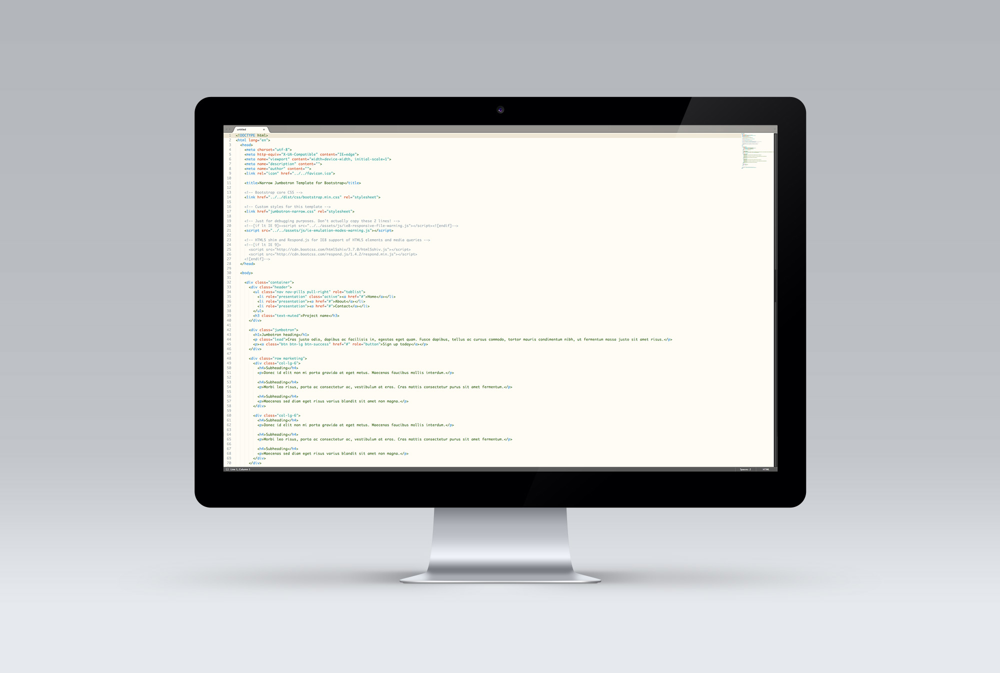

# Sublime Text 绿柔主题配色

绿柔主题的特点是柔和、低对比度、强光可见、绿色感加强。对着这样的界面写一天代码，感受要比对着太亮或太暗的界面舒服很多。

绿柔是一个严谨的设计过程，包含色彩心理学和色彩生理学的很多知识，而且在北京国奥心理医院做过严谨的医学测试，形成大量脑电波数据。

我们现在的生活中到处是电子屏，电脑屏、手机屏、平板、电视，无论上班下班，我们都对着这些屏幕。这个时代保护眼睛更重要。一定不能程序员让在写代码时受更多罪。所以我们很重视配色方案。

我们调研了所有主流配色方案。没有满意的。有的很漂亮，但长时间看不舒服。所以我们决定自己调，但我们的设计目的不是为了好看，而是为了更健康。

色彩方面有色彩生理学和色彩心理学。我们先来看色彩生理学，当一个人眼睛长期看暗色系事物时，大脑会分泌激素强迫眼睛增强视力，比如我们在一个黑屋子待一会就能看清东西，但回到阳光下时又会晕眩，这叫做暗适应。暗适应会让程序员很不舒服，所以我们不能选暗色系。

再看色彩心理学，不同的色彩给人以不同的心理感受。红色让人感到刺激，绿色让人感到舒适，因为人们会联想到不同的事物从而引发心理的变化。

基于这些分析，调了上百次后，我们得出这样的方案，我们叫它绿柔。它的特点是柔和，自然，低对比度，并且强化了绿色的感觉。我们把各种颜色中的RGB中G，就是绿的数值调的更高。

我们做了样本测试，结果不错，程序员们在使用了一天绿柔界面后都表示比看一天其他软件更舒服。
最后衷心祝愿大家在满是电子屏的世界中，活的更健康！

---

脑电波实验证明使用绿柔缓解脑疲劳！

### 理念

每天盯着屏幕写代码，程序员的健康非常重要，

为此我们用心设计了HBuilder的视觉主题方案——绿柔。

绿柔不是简单的配色，她不追求酷炫，而追求：舒适、护眼、和身心健康。

绿柔结合了色彩生理学和色彩心理学，参考了电子书的设计，

并根据用户显示器的发光特点，智能调配而成。

### 原理

绿柔，色调柔和、对比度低、绿色感加强，

绿柔下工作能减少眼球充血，舒缓眼部肌肉，降低脑电波疲劳值。

与黑色主题相比，绿柔还能防近视、防晕眩、防止暗适应、

减少维生素A消耗，防止或减轻夜盲症。

[http://www.colorsublime.com/how-to-install-a-theme](http://www.colorsublime.com/how-to-install-a-theme)