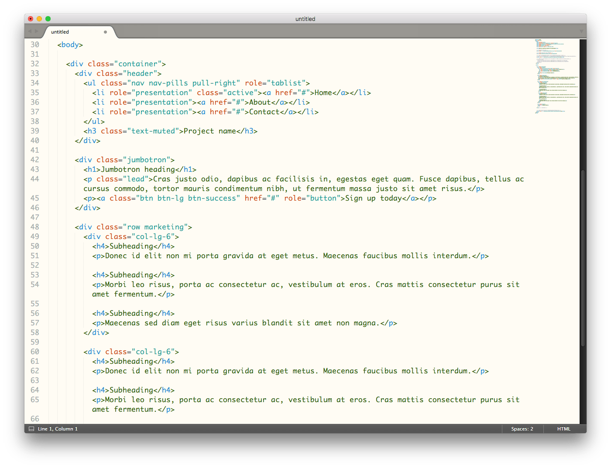

# Sublime Text 绿柔主题配色

脑电波实验证明使用绿柔缓解脑疲劳！

### 理念

每天盯着屏幕写代码，程序员的健康非常重要，

绿柔不是简单的配色，她不追求酷炫，而追求：舒适、护眼、和身心健康。

绿柔结合了色彩生理学和色彩心理学，参考了电子书的设计，

并根据用户显示器的发光特点，智能调配而成。

### 原理

绿柔，色调柔和、对比度低、绿色感加强，

绿柔下工作能减少眼球充血，舒缓眼部肌肉，降低脑电波疲劳值。

与黑色主题相比，绿柔还能防近视、防晕眩、防止暗适应、

减少维生素A消耗，防止或减轻夜盲症。

---

## 安装

使用 Package Control 安装：

1. 输入快捷键 <kbd>Cmd</kbd> + <kbd>Shift</kbd> + <kbd>P</kbd> (OS X) <kbd>Ctrl</kbd> + <kbd>Shift</kbd> + <kbd>P</kbd> (Win/Linux)。
2. 键入 "install package" 并回车. Then search for "Green Care Theme"

自助安装：

1. Download the latest release, extract and rename the directory to "GreenCareTheme".
2. Move the directory inside your sublime `Packages` directory. **(Preferences > Browse packages...)**

## Usage

## Previews

