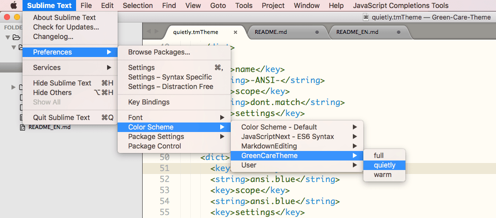
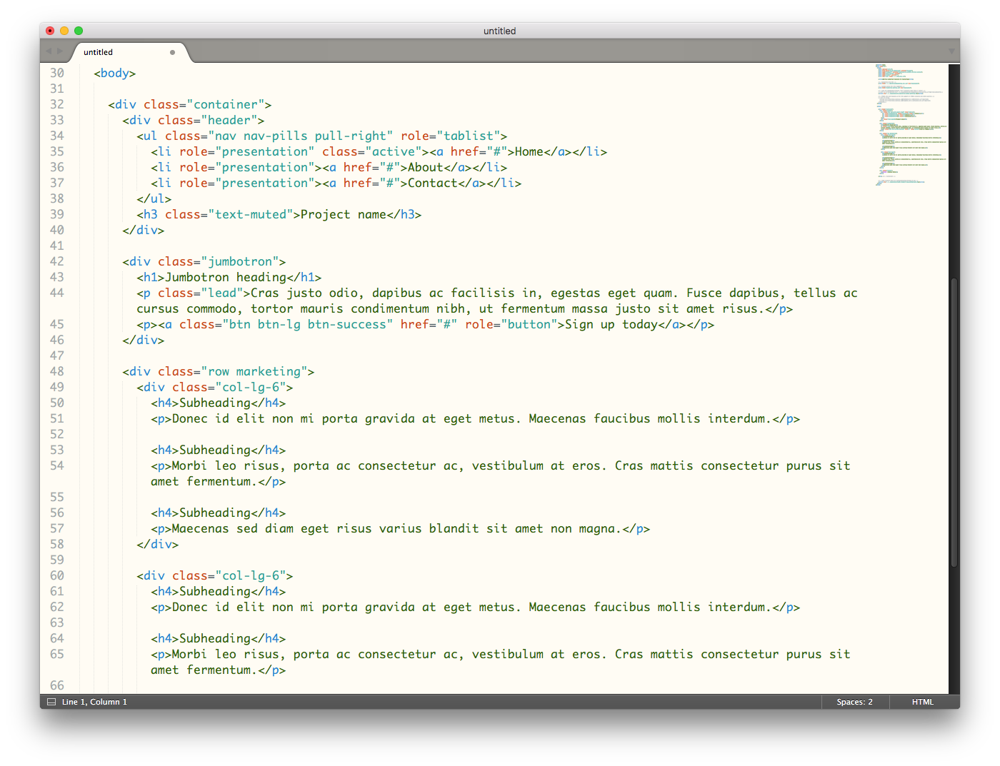

# Green-Care-Theme

A Green Care Theme for Sublime Text. Comfortable to your eyes.

## Easy installation

You can install this awesome color scheme through the Package Control.

1. Press <kbd>Cmd</kbd> + <kbd>Shift</kbd> + <kbd>P</kbd> (OS X) <kbd>Ctrl</kbd> + <kbd>Shift</kbd> + <kbd>P</kbd> (Win/Linux) to open the command palette.
2. Type "install package" and press enter. Then search for "Green Care Theme"

## Manual installation

1. Download the latest release, extract and rename the directory to "GreenCareTheme".
2. Move the directory inside your sublime `Packages` directory. **(Preferences > Browse packages...)**

## Usage

## Previews

